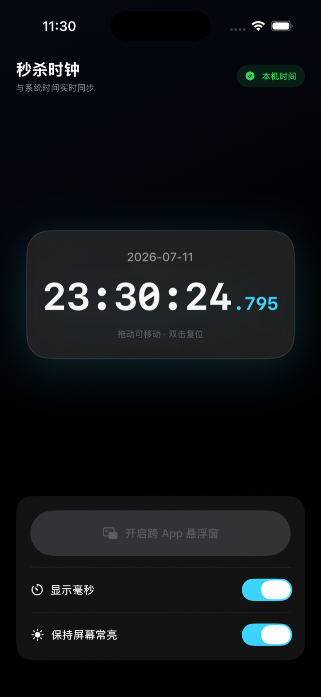

# Gaber · 秒杀时钟

A precision clock for iOS that shows the **system time down to the millisecond** — and can float **on top of any app** as a Picture-in-Picture window. Built for flash sales (秒杀), ticket drops, and any moment where a second is too coarse.

一款 iOS 高精度时钟：毫秒级显示本机系统时间，并且可以通过画中画（PiP）**悬浮在任意 App 之上**。为秒杀、抢票、整点开抢等场景而生。

<p align="center">
  
</p>

## Features · 功能

- **Millisecond clock / 毫秒时钟** — renders the live system time at up to 60 fps with a monospaced layout, so digits never jitter. 与系统时间实时同步，等宽字体不抖动。
- **Cross-app floating window / 跨 App 悬浮窗** — one tap starts a Picture-in-Picture window that keeps showing the ticking clock while you switch to a shopping or ticketing app. 一键开启画中画悬浮窗，切到购物 / 抢票 App 后时钟仍在最上层走字。
- **Keep screen awake / 保持屏幕常亮** — optionally disables the idle timer while the app is in the foreground. 可选阻止自动锁屏。
- **Show / hide milliseconds / 毫秒开关** — toggle the `.xxx` tail when you only need seconds.
- **Draggable clock card / 可拖动时钟卡片** — drag the card around (it always keeps part of itself on screen), double-tap to snap it back to center. 拖动移动时钟，双击复位。

## Requirements · 环境要求

- iOS **18.0+** (iPhone & iPad)
- Xcode **16+** to build
- The floating window uses Picture-in-Picture, which is **not available in the iOS Simulator** — test that feature on a real device. 悬浮窗功能依赖画中画，模拟器不支持，请用真机验证。

## Build & Run · 构建

```bash
git clone https://github.com/Luffky/gaber.git
cd gaber
open timer.xcodeproj        # then ⌘R in Xcode
```

Or from the command line:

```bash
xcodebuild -project timer.xcodeproj -scheme timer \
  -destination 'platform=iOS Simulator,name=iPhone 17 Pro' build
```

## How the floating clock works · 悬浮窗原理

iOS has no general-purpose overlay API, so Gaber uses the system **Picture-in-Picture** pipeline to float across apps:

1. `PictureInPictureClock` draws the current time into a `CVPixelBuffer` with Core Graphics, 30 times per second.
2. Each frame is wrapped in a `CMSampleBuffer` and enqueued on an `AVSampleBufferDisplayLayer`.
3. That layer backs an `AVPictureInPictureController` (`ContentSource(sampleBufferDisplayLayer:playbackDelegate:)`), so the system treats the clock as a live video and hosts it in the PiP window above other apps.
4. The `audio` background mode (“Audio, AirPlay, and Picture in Picture”) keeps rendering alive while the app is in the background.

iOS 没有通用的悬浮窗 API，Gaber 借助系统画中画通道实现跨 App 悬浮：每秒 30 次用 Core Graphics 把时间画进 `CVPixelBuffer`，封装为 `CMSampleBuffer` 送入 `AVSampleBufferDisplayLayer`，再由 `AVPictureInPictureController` 作为“视频”托管到画中画窗口。

## Project layout · 目录结构

```
timer/
├── timerApp.swift              # @main entry point
├── ContentView.swift           # Clock UI, settings, PiP controls
├── PictureInPictureClock.swift # PiP controller + 30 fps frame renderer
├── Info.plist                  # Background modes (audio, PiP)
└── Assets.xcassets             # App icon, accent color
timer.xcodeproj                 # Xcode project (scheme: timer)
docs/                           # Release / App Store notes
```

## Releasing · 发布

See [docs/RELEASE.md](docs/RELEASE.md) for the App Store checklist — bundle ID / signing, versioning, privacy manifest, export compliance, and App Review notes specific to the PiP clock.

## Author

Made by [@Luffky](https://github.com/Luffky) (gab). App Store publishing assistance by friends.
